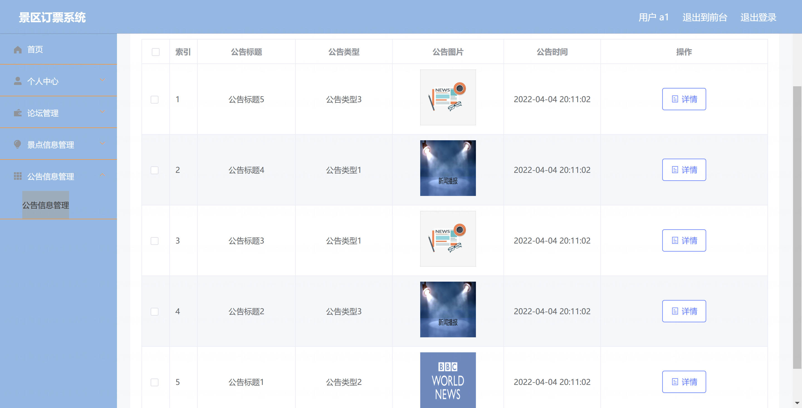

基于Springboot的景区订票系统（程序+论文）
=

### 完整代码获取地址：从戎源码网 ([https://armycodes.com/](https://armycodes.com/))
### 作者微信：19941326836  QQ：952045282 
### 承接计算机毕业设计、Java毕业设计、Python毕业设计、深度学习、机器学习
### 选题+开题报告+任务书+程序定制+安装调试+论文+答辩ppt 一条龙服务
### 所有选题地址https://github.com/nature924/allProject

一、项目介绍
---
系统包含两种角色：用户、管理员，系统分为前台和后台两大模块，主要功能如下：

基于 Spring Boot 的景区订票系统，系统角色为管理员（后台）和普通用户（前端），主要功能如下：

管理员（后台）：
基本操作：登录、修改密码、获取/修改个人信息、登出
用户管理：用户列表/详情、新增/修改/删除用户、重置密码、批量导入（xls）
景点管理：景点列表/详情、新增/修改/删除景点、批量导入
订单管理：订单列表/详情、手工保存/修改/删除订单、查看并处理用户预定（含余额变更）
收藏管理：景点收藏记录的列表/新增/删除
留言/论坛管理：帖子与景点留言的 CRUD 与审核
公告与轮播图（配置）管理：公告与配置（轮播图）CRUD
文件管理：文件上传/管理（static/upload）、导入/导出（Excel）

普通用户（前端）：
账号：注册、登录、修改个人信息、查看会话/退出、找回/重置密码
景点浏览：景点列表、详情、筛选/排序、查看图片与内容
收藏与留言：收藏景点、查看/新增景点留言
论坛/公告：查看公告列表与论坛帖子、发帖/回复（前端公开接口）
预定/支付：下单预定景点（创建订单）、使用账户余额支付、查看订单列表与详情
个人中心：查看/编辑个人信息、查看我的订单/收藏

二、项目技术
---
- 编程语言：Java
- 数据库：MySQL
- 项目管理工具：Maven
- 前端技术：VUE、HTML、Jquery、Bootstrap
- 后端技术：Spring、SpringMVC、MyBatis

三、运行环境
---
- 操作系统：Windows、macOS都可以
- JDK版本：JDK1.8以上都可以
- 开发工具：IDEA、Ecplise、Myecplise都可以
- 数据库: MySQL5.7以上都可以
- Tomcat：任意版本都可以
- Maven：任意版本都可以

四、运行截图
---
### 论文截图：

### 程序截图：

